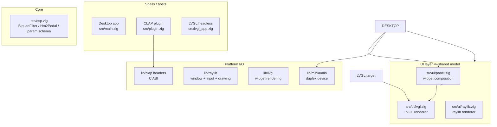
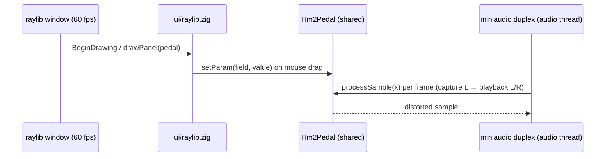
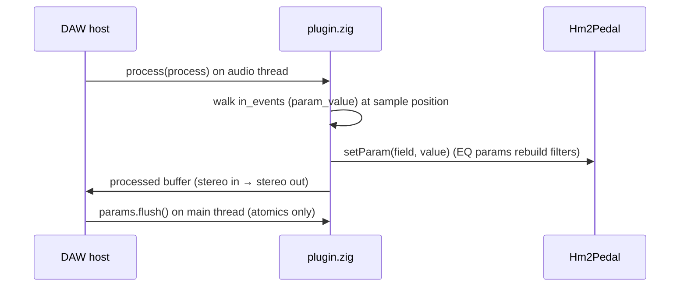

# Architecture

## Layers

**Rule of the codebase:** arrows only point *down*. Shells depend on `ui` and
`dsp`; `ui` depends on `dsp` for parameter data; `dsp` depends on nothing but
`std.math`. The DSP core must remain free of UI and I/O imports — that is what
makes the same core usable by a DAW's audio thread and, later, an ESP32.

## File map

| File | Responsibility |
|---|---|
| `src/dsp.zig` | `BiquadFilter`, `Hm2Pedal` (init/updateEq/processSample), `getParam`/`setParam`, and the **parameter schema** (`ParamField`, `ParamDef`, `params`) |
| `src/ui/panel.zig` | Declarative widget list — what the UI shows, bound to `dsp.ParamField`s |
| `src/ui/raylib.zig` | Desktop renderer: 2×2 knob grid, mouse-drag input, custom drawing |
| `src/ui/lvgl.zig` | LVGL renderer: `lv_arc` + `lv_label` per widget |
| `src/main.zig` | Desktop shell: raylib window loop + miniaudio duplex device |
| `src/plugin.zig` | CLAP plugin: `clap_entry` → factory → plugin instance, params/audio-ports/state extensions, `process()` |
| `src/lvgl_app.zig` | Headless LVGL host: virtual RGB565 display + `lv_timer_handler` loop |
| `src/bindings.zig` | Pre-generated Zig bindings for **miniaudio** (from `src/bindings.c`) |
| `src/raylib_bindings.zig` | Pre-generated bindings for **raylib** (from `src/raylib_bindings.c`) |
| `src/clap_bindings.zig` | Pre-generated bindings for **CLAP** (from `src/clap_bindings.c`), with documented ABI patches |
| `src/lvgl_bindings.zig` | Pre-generated bindings for **LVGL** (from `src/lvgl_bindings.c`) |
| `build.zig` | All three targets + raylib/LVGL C compilation |
| `compile_commands.json` / `.clangd` | Editor (clangd) include paths for the C sources |

## Parameter contract (single source of truth)

`src/dsp.zig` defines the four parameters. **These IDs are frozen** — they are
published in CLAP automation and serialized in plugin state:

| ID | Name | Field | Range | Default |
|---|---|---|---|---|
| 1 | GAIN | `.gain` | 0–30 (unit ` dB`) | 12 |
| 2 | LEVEL | `.level` | 0–1 | 0.4 |
| 3 | LOW | `.low_gain_db` | 0–25 (unit ` dB`) | 18 |
| 4 | HIGH | `.high_gain_db` | 0–25 (unit ` dB`) | 20 |

Every shell reads ranges/labels/defaults from `dsp.params`; changing the pedal
means changing this table and the DSP math — never per-shell copies.

## Data flow per target

**Desktop app**

**CLAP plugin**

**LVGL (headless today)**

`lvgl_app.zig` creates a virtual 240×320 RGB565 display (flush discards
pixels), builds the panel once, then pumps `lv_timer_handler()` and refreshes
arc values from the pedal. On hardware the same file compiles under ESP-IDF
with a real display driver in `flush_cb` — see [roadmap.md](roadmap.md).

## Threading notes (honest state)

- **CLAP plugin**: the audio thread is the *only* writer of `Hm2Pedal` fields;
  the main thread (state load, `flush()`) publishes values through
  `std.atomic.Value(u32)` (bit-cast f32). This is the correct pattern and is
  exercised by the tests.
- **Desktop app**: the UI thread writes pedal fields directly while the audio
  thread reads them — same as the original ImGui version. A single aligned
  `f32` store is atomic on x86-64 in practice, but this is not formally
  synchronized; switching the desktop app to the same atomic parameter store
  as the plugin is on the roadmap.