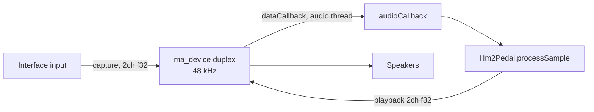

# Audio I/O: miniaudio duplex (`lib/miniaudio`)

## What it does

The desktop app streams a real-time guitar rig:



- Device type: `ma_device_type_duplex` — one device does capture **and**
  playback, so the round-trip latency is just the driver's (WASAPI shared
  mode ≈ 10–30 ms; exclusive/ASIO-class latency needs lower-level work).
- Format: `f32` stereo both sides; `sampleRate` 48 000.
- `config.dataCallback = audioCallback` + `config.pUserData = &pedal`.

## The callback

```zig
fn audioCallback(pDevice, pOutput, pInput, frameCount) callconv(.c) void {
    const pedal: *dsp.Hm2Pedal = @ptrCast(@alignCast(pDevice.*.pUserData));
    ...
    const in_sample  = input_buf[i * 2];          // left channel in
    const out_sample = pedal.processSample(in_sample);
    output_buf[i * 2]     = out_sample;           // L
    output_buf[i * 2 + 1] = out_sample;           // R (mono → dual mono)
}
```

Deliberate mono behavior (the original design): the left input is processed
once and copied to both output channels, halving the DSP load. Stereo-guitar
users would instead run both channels through independent pedal instances.

## Why miniaudio stays

raylib ships `raudio.c` (its own miniaudio copy) for *playback* APIs — it is
**not compiled** into this build (`build.zig` documents why): two miniaudio
copies in one binary would collide at link time, and our need is *duplex*
processing with an arbitrary callback, which `ma_device` handles directly.

The C side is a single translation unit (`miniaudio_impl.c` =
`#define MINIAUDIO_IMPLEMENTATION` + `#include "miniaudio.h"`), compiled with
`-std=c99`. Zig consumes the API via the pre-generated `src/bindings.zig`
(see [bindings.md](bindings.md)).

## Known sharp edges

- **No device selection**: `ma_device_init(null, …)` uses the OS default
  devices. A device picker (and `ma_context` device enumeration) is a natural
  next step.
- **No latency guard**: the UI-thread parameter writes are effectively atomic
  on x86-64 but not formally synchronized (desktop-only concern; the CLAP
  plugin already uses proper atomics).
- **No underrun/reconnect handling**: if the default device disappears
  (USB interface unplugged), the app keeps running silently — rebuilding the
  device on error is a roadmap item.