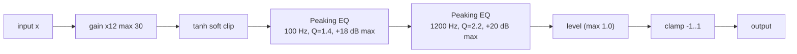

# DSP: the HM-2 signal chain

`src/dsp.zig` implements the BOSS HM-2 "Swedish Chainsaw" voicing used by
melodeath/death metal (Entombed, Dismember…). The chain is deliberately simple:



## Per-sample processing

```zig
var x = input * self.gain;     // pre-gain
x = math.tanh(x);              // soft clip
x = self.low_boost.process(x);
x = self.high_boost.process(x);
return math.clamp(x * self.level, -1.0, 1.0);
```

- `tanh` gives the "saw chain" saturation: signals above ~1 collapse into a
  plateau, so the pedal is designed to be *driven* — the LOW/HIGH EQ then
  sculpts the resulting harmonics (the HM-2's famous "color mix").
- LOW (100 Hz peaking) is the "mud/darkness" control; HIGH (1.2 kHz peaking,
  high Q) is the "buzz/scream" control.
- The final `clamp` guarantees output ∈ [-1, 1] even for pathological input.

## Biquad implementation

Each EQ band is an RBJ "peaking EQ" biquad (`BiquadFilter.initPeaking`),
computed in direct form coefficients:

```
A = 10^(gain_dB / 40)
w0 = 2π f0 / fs
alpha = sin(w0) / (2Q)

b0 = (1 + alpha·A) / a0      a0 = 1 + alpha/A
b1 = -2·cos(w0) / a0         a1 = -2·cos(w0) / a0
b2 = (1 - alpha·A) / a0      a2 = 1 - alpha/A
```

`process()` is the classic transposed-direct-form-II-free recurrence:

```zig
output = b0·x + b1·x1 + b2·x2 − a1·y1 − a2·y2
x2 = x1; x1 = x; y2 = y1; y1 = output
```

Notes:

- `updateEq()` recomputes both filters whenever a dB parameter changes. It is
  cheap (two 6-op coefficient evaluations) and is called mid-buffer by the
  CLAP plugin when automation events land — no de-zippering yet.
- Filter state (`x1..y2`) survives between buffers; `pluginReset()` (CLAP)
  zeroes it. The desktop app keeps filter state for the session lifetime.
- Everything is `f32`; no heap, no allocations, no C imports — the module
  compiles unchanged for freestanding targets.

## Parameter schema

Also lives in `dsp.zig` (see [architecture.md](architecture.md) for the table).
`Hm2Pedal.setParam(field, value)` is the single write entry point; UI renderers
and the CLAP plugin both call it. EQ fields trigger `updateEq()` internally.

## Tests

```sh
zig test src/dsp.zig
```

- "silence entra, silência sai" — zero input produces zero output.
- "saída sempre dentro de [-1, 1]" — 1000 saturated samples stay clamped.