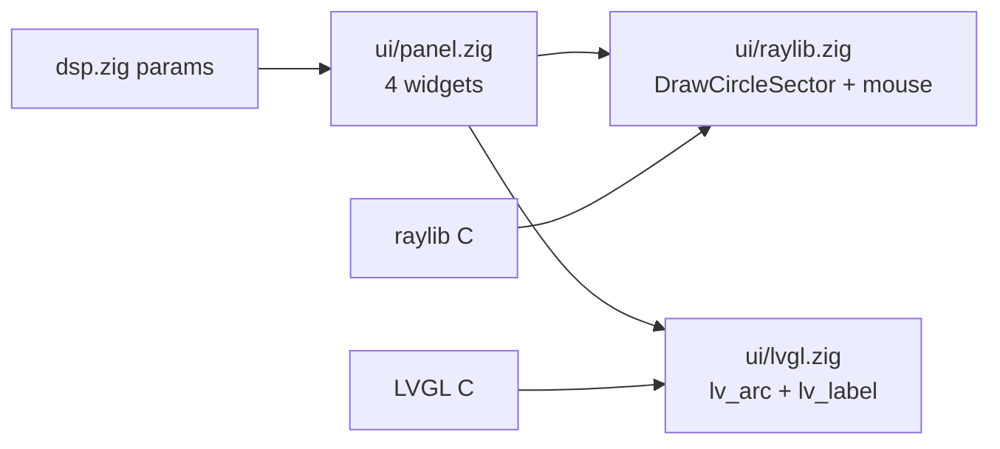

# UI: one panel model, two renderers

The UI was rewritten (ImGui removed). The design goal: **the same interface
definition compiles for raylib (desktop) and LVGL (embedded)**, so an ESP32
pedal and the desktop app can never drift apart.

## The contract

Two modules define everything the UI knows:

1. **`src/dsp.zig` — parameter schema.** `dsp.params` is the parameter table
   (stable IDs, display names, ranges, defaults, units) and
   `Hm2Pedal.getParam/setParam` are the single read/write entry points.
2. **`src/ui/panel.zig` — panel composition.** A list of widgets, each bound to
   a `dsp.ParamField`:

```zig
pub const panel = [_]Widget{
    .{ .field = .gain,         .label = "GAIN" },
    .{ .field = .high_gain_db, .label = "HIGH" },
    .{ .field = .low_gain_db,  .label = "LOW" },
    .{ .field = .level,        .label = "LEVEL" },
};
```

Renderers decide *how* to present this. Adding a parameter to the pedal is:
extend `dsp.params` + `setParam/getParam`, add a `Widget` to the panel — and
the desktop app, the CLAP plugin and the LVGL build all pick it up.



## Renderer: raylib (desktop)

`src/ui/raylib.zig` — immediate-mode drawing over raylib's 2D API:

- **Body**: `DrawCircleSector` from 135° for a 270° sweep (gap at the bottom).
- **Track**: the remaining (unfilled) sweep is drawn darker, so the arc reads
  like a volume knob.
- **Needle**: `DrawLineEx` from the center at `135° + 270°·t`.
- **Label/value**: `DrawText` with `MeasureText` centering; values formatted
  with `std.fmt.bufPrintZ` ("12.00 dB").
- **Input**: `CheckCollisionPointCircle` hover + `IsMouseButtonDown(LEFT)` +
  `GetMouseDelta().y` — vertical drag, same interaction as the old ImGui knob
  (`drag_sensitivity = 0.005` of the full range per pixel).
- Layout is a fixed 2×2 grid for the default 500×350 window.

Writes go through `pedal.setParam(field, value)` — identical to the CLAP path.

## Renderer: LVGL (headless today, ESP32 target)

`src/ui/lvgl.zig` builds one `lv_arc` + one `lv_label` per widget:

- `lv_arc_set_range(arc, min, max)` from the param spec; value via
  `lv_arc_set_value` on `Panel.refresh(pedal)`.
- `LV_ARC_MODE_REVERSE` + bg angles 135°→45° replicate the knob look.
- Styling: accent color via `lv_obj_set_style_arc_color(..., LV_PART_INDICATOR)`.
- Layout: 2×2 absolute positions tuned for a 240×320 SPI display; labels are
  aligned `OUT_BOTTOM_MID` relative to each arc.

`src/lvgl_app.zig` is the validation host: it creates a virtual 240×320 RGB565
display (partial render mode, `flush_cb` discards pixels), builds the panel on
the active screen, and runs `lv_timer_handler()` for 10 ticks. It prints one
line and exits — proving the renderer works against real LVGL without any
display hardware. Run it with:

```sh
zig build -Dlvgl
./zig-out/bin/hm2_lvgl.exe
```

## Adding a widget

1. If it maps to a new sound parameter: extend `dsp.params` **and** add a
   branch to `Hm2Pedal.getParam`/`setParam`. Choose the CLAP parameter ID now —
   it becomes frozen the moment a DAW saves state.
2. Add a `Widget` to `ui/panel.zig`.
3. Handle its drawing in `ui/raylib.zig` and its widget in `ui/lvgl.zig`
   (today only `.knob` exists; sliders/switches would follow the same pattern).

## Why not ImGui anymore?

ImGui is fine for tools, but the pedal is a product UI, and raylib's API is
also the user's learning investment for future projects. Removing it also
removed: the cimgui/ImGui C++ compile, the C++ runtime (`-lc++`), the
`IMGUI_IMPL_API` linkage trick, and the prebuilt `glfw3.lib/.dll` — raylib
bundles its own GLFW and is statically linked. The whole desktop app is now
one self-contained `.exe`.